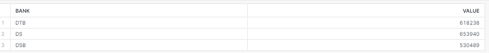
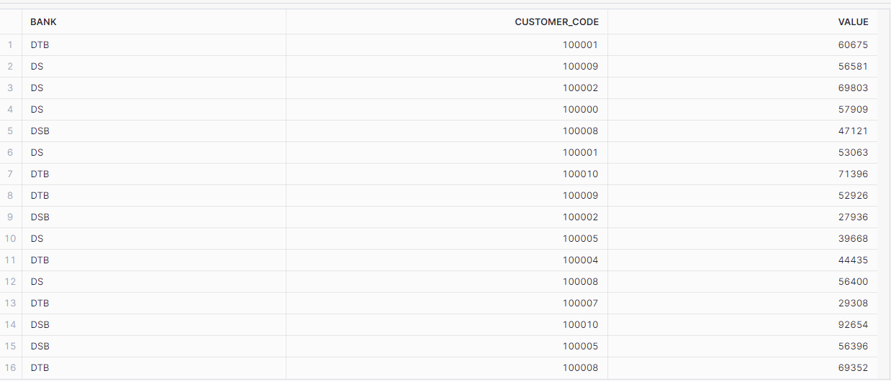

# Preppn challenge 2023 Week 1

Solving Tableau Prep challenge 2023 Week 1 using SQL/Snowflake

## About the excercise

Created by Carl Allchin, these excercises are a great way of learning anf developing data preparation skills.
Whilst designed as Tableau Prep challenges, they are an excellent way to improve SQL skills. Find them [here](https://preppindata.blogspot.com/p/the-challenge-index.html).

**TASK**

2023 Week 1 - This week we have had a report with a number of transactions that have not just our transactions but other banks' too. Can you help clean up the data?

- Split the Transaction Code to extract the letters at the start of the transaction code. These identify the bank who processes the transaction.
- Rename the values in the Online or In-person field, Online of the 1 values and In-Person for the 2 values. - Change the date to be the day of the week (help)
- Different levels of detail are required in the outputs. You will need to sum up the values of the transactions in three ways (help):
  1. Total Values of Transactions by each bank
  2. Total Values by Bank, Day of the Week and Type of Transaction (Online or In-Person)
  3. Total Values by Bank and Customer Code

**SQL/Snowflake Techniques Used**

I used Snowflake to write and execute SQL queries.

1.  Splitting strings with SPLIT_PART
2.  Case Statements
3.  Converting strings to dates

## Solution

### 1. Split the Transaction Code and Total Values of Transactions by each bank

Using SPLIT_PART function and '-' as delimiter, I extracted the first part of the string and renamed the new column as Bank.

```
    SELECT SPLIT_PART (TRANSACTION_CODE,'-', 0) as Bank, SUM(VALUE) as VALUE
        FROM PD2023_WK01
            GROUP BY Bank
        ;
```

Aggregating the values and grouping by on new column gives me the 1st Output



### 2. Total Values by Bank, Day of the Week and Type of Transaction (Online or In-Person)

Using Case Statments, I converted the values in the Online or In person column to the desired values.
Date was in string format, used DATE function to change it in date and wrapping it in DAY function gave me the name of the day.

```
    SELECT SPLIT_PART (TRANSACTION_CODE,'-', 0) as Bank,
            CASE
                WHEN online_or_in_person = 2
                    THEN 'In-Person'
                WHEN online_or_in_person = 1
                    THEN 'Online'
                        END as online_or_in_person,
            DAYNAME( DATE(LEFT(transaction_date,10), 'dd/MM/yyyy')) as day,
            SUM(Value) as Value

        FROM PD2023_WK01
            GROUP BY Bank,type, d
        ;
```


### 3. Total Values by Bank and Customer Code

It was straightforward as I already had the Bank column.

```
    SELECT SPLIT_PART (TRANSACTION_CODE,'-', 0) as Bank,
            CUSTOMER_CODE, SUM(Value) as Value

        FROM PD2023_WK01
            GROUP BY 1, 2
        ;
```



With this, I had all the three input required.
